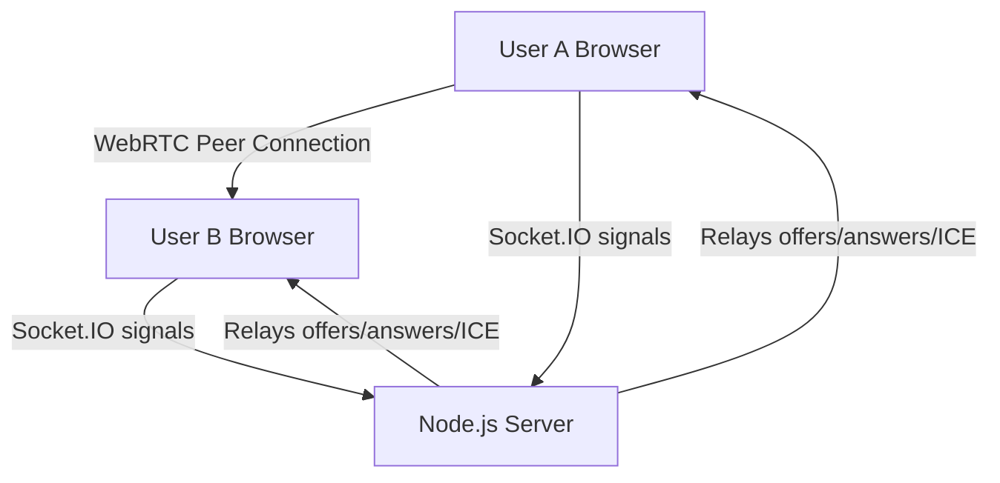
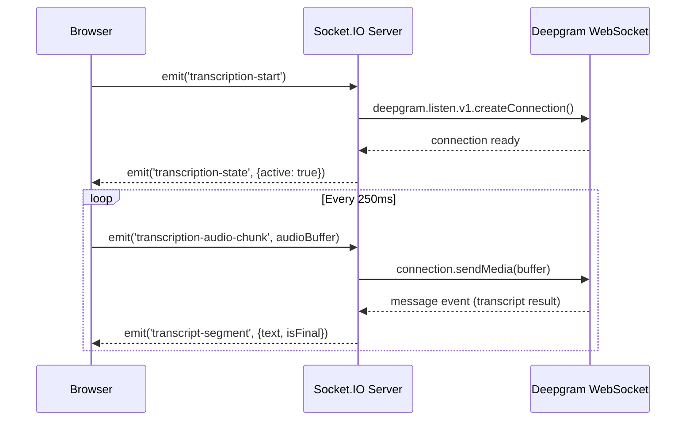
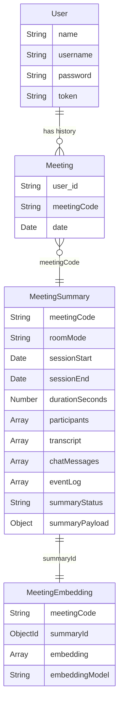

# Zoom Clone — Complete Feature Walkthrough

> [!NOTE]
> **Stack**: React 19 frontend + Express 5 / Socket.IO backend, MongoDB database.
> Key external services: **Deepgram** (transcription), **Twilio** (TURN servers), **Gemini AI** (summaries + embeddings).

---

## 1. Authentication (Register / Login)

### Libraries
| Library | Purpose |
|---------|---------|
| `bcrypt` | Hash & compare passwords |
| `crypto` (Node built-in) | Generate random session tokens |
| `mongoose` | MongoDB ODM for User model |
| `axios` (frontend) | HTTP requests to backend |

### How it works

**User Model** — [user.model.js](file:///C:/Users/maazk/Videos/C,%20C++%20and%20HTML/Projects/Zoom/backend/src/models/user.model.js)

```js
const userSchema = new mongoose.Schema({
    name:     { type: String, required: true },
    username: { type: String, required: true, unique: true },
    password: { type: String, required: true },
    token:    { type: String }   // session token, set on login
});
```

**Register** — [user.controller.js:L55-100](file:///C:/Users/maazk/Videos/C,%20C++%20and%20HTML/Projects/Zoom/backend/src/controllers/user.controller.js#L55-L100)

1. Checks if username already exists via `User.findOne({ username })`
2. Hashes password: `bcrypt.hash(password, 10)` — 10 salt rounds
3. Saves new `User` document to MongoDB

**Login** — [user.controller.js:L102-146](file:///C:/Users/maazk/Videos/C,%20C++%20and%20HTML/Projects/Zoom/backend/src/controllers/user.controller.js#L102-L146)

1. Finds user by username
2. Compares password: `bcrypt.compare(password, user.password)`
3. Generates a **40-char hex token**: `crypto.randomBytes(20).toString('hex')`
4. Saves token to the user document, returns it to frontend

**Frontend** — [AuthContext.jsx](file:///C:/Users/maazk/Videos/C,%20C++%20and%20HTML/Projects/Zoom/frontend/src/contexts/AuthContext.jsx) stores `token`, `username`, `name` in `localStorage` after login:

```js
localStorage.setItem("token", request.data.user.token);
localStorage.setItem("username", request.data.user.username);
```

**Auth Middleware** — [auth.middleware.js](file:///C:/Users/maazk/Videos/C,%20C++%20and%20HTML/Projects/Zoom/backend/src/middleware/auth.middleware.js) protects routes by looking up the token:

```js
const user = await User.findOne({ token });
if (!user) return res.status(401).json({ message: 'Invalid or expired token' });
req.user = user;
next();
```

---

## 2. Video Calling (WebRTC + Socket.IO)

### Libraries
| Library | Purpose |
|---------|---------|
| `socket.io` (backend) | Real-time signaling server |
| `socket.io-client` (frontend) | Connects to signaling server |
| `twilio` | Fetches TURN/STUN ICE server credentials |
| **Browser WebRTC APIs** | `RTCPeerConnection`, `getUserMedia`, `getDisplayMedia` |

### Architecture: Mesh Topology with Socket.IO Signaling



### ICE Servers (STUN/TURN via Twilio)

[user.controller.js:L196-219](file:///C:/Users/maazk/Videos/C,%20C++%20and%20HTML/Projects/Zoom/backend/src/controllers/user.controller.js#L196-L219)

```js
const client = twilio(accountSid, authToken);
const token = await client.tokens.create();  // Twilio's tokens.create()
return res.json({ iceServers: token.iceServers });
```

Frontend fetches these before connecting — [VideoMeet.jsx:L89-100](file:///C:/Users/maazk/Videos/C,%20C++%20and%20HTML/Projects/Zoom/frontend/src/pages/VideoMeet.jsx#L89-L100):

```js
const response = await axios.get(`${server_url}/api/users/ice-servers`);
const iceServers = response?.data?.iceServers;
```

Falls back to Google STUN servers if Twilio fails:
```js
const defaultIceServers = [
    { urls: 'stun:stun.l.google.com:19302' },
    { urls: 'stun:stun1.l.google.com:19302' }
];
```

### Joining a Call

**Backend** — [socketManager.js:L225-328](file:///C:/Users/maazk/Videos/C,%20C++%20and%20HTML/Projects/Zoom/backend/src/socket/socketManager.js#L225-L328)

When `join-call` is received:
1. Validates the meeting code and room mode (`guest` vs `member`)
2. For member rooms: verifies the token via `User.findOne({ token })`
3. Adds socket ID to `connections` Map, tracks participant in `roomParticipants`
4. Broadcasts `user-joined` to all room clients with the full client list + username map

**Frontend** — [VideoMeet.jsx:L754-981](file:///C:/Users/maazk/Videos/C,%20C++%20and%20HTML/Projects/Zoom/frontend/src/pages/VideoMeet.jsx#L754-L981)

```js
socketRef.current = io(server_url, {
    transports: ['websocket', 'polling'],
    withCredentials: true
});

socketRef.current.on('connect', () => {
    socketRef.current.emit('join-call', {
        meetingCode, username, isGuest: isGuestMeeting,
        token: isGuestMeeting ? null : token
    });
});
```

### WebRTC Peer Connection Setup

[VideoMeet.jsx:L589-620](file:///C:/Users/maazk/Videos/C,%20C++%20and%20HTML/Projects/Zoom/frontend/src/pages/VideoMeet.jsx#L589-L620) — `ensurePeerConnection()`:

```js
const peerConnection = new RTCPeerConnection(activePeerConfig);

peerConnection.onicecandidate = (event) => {
    if (event.candidate != null) {
        socketRef.current.emit('signal', socketListId, 
            JSON.stringify({ 'ice': event.candidate }));
    }
};

peerConnection.ontrack = (event) => {
    if (event.streams && event.streams[0]) {
        upsertRemoteStream(socketListId, event.streams[0]);
    }
};

window.localStream.getTracks().forEach((track) => {
    peerConnection.addTrack(track, window.localStream);
});
```

### SDP Offer/Answer Exchange

[VideoMeet.jsx:L732-751](file:///C:/Users/maazk/Videos/C,%20C++%20and%20HTML/Projects/Zoom/frontend/src/pages/VideoMeet.jsx#L732-L751) — `gotMessageFromServer()`:

```js
if (signal.sdp) {
    fromPeer.setRemoteDescription(new RTCSessionDescription(signal.sdp))
        .then(() => {
            if (signal.sdp.type === 'offer') {
                fromPeer.createAnswer().then((description) => {
                    fromPeer.setLocalDescription(description).then(() => {
                        socketRef.current.emit('signal', fromId, 
                            JSON.stringify({ 'sdp': fromPeer.localDescription }));
                    });
                });
            }
        });
}
if (signal.ice) {
    fromPeer.addIceCandidate(new RTCIceCandidate(signal.ice));
}
```

Backend relays signals directly — [socketManager.js:L331-333](file:///C:/Users/maazk/Videos/C,%20C++%20and%20HTML/Projects/Zoom/backend/src/socket/socketManager.js#L331-L333):
```js
socket.on('signal', (toId, message) => {
    io.to(toId).emit('signal', socket.id, message);
});
```

### Media: Camera, Mic, Screen Share

- **getUserMedia**: `navigator.mediaDevices.getUserMedia({ video: true, audio: true })` — [VideoMeet.jsx:L659](file:///C:/Users/maazk/Videos/C,%20C++%20and%20HTML/Projects/Zoom/frontend/src/pages/VideoMeet.jsx#L659)
- **getDisplayMedia**: `navigator.mediaDevices.getDisplayMedia({ video: true })` — [VideoMeet.jsx:L703](file:///C:/Users/maazk/Videos/C,%20C++%20and%20HTML/Projects/Zoom/frontend/src/pages/VideoMeet.jsx#L703)
- **replaceTrack** (no renegotiation): [VideoMeet.jsx:L546-569](file:///C:/Users/maazk/Videos/C,%20C++%20and%20HTML/Projects/Zoom/frontend/src/pages/VideoMeet.jsx#L546-L569)

```js
const videoSender = senders.find(s => s.track?.kind === 'video');
if (videoSender && videoTrack) {
    videoSender.replaceTrack(videoTrack);  // seamless, no renegotiation
}
```

---

## 3. Live Transcription (Deepgram)

### Libraries
| Library | Purpose |
|---------|---------|
| `@deepgram/sdk` (`DeepgramClient`) | Real-time speech-to-text WebSocket |
| **Browser `MediaRecorder` API** | Captures mic audio as chunks |

### Flow



### Backend: Deepgram Session

[transcriptionManager.js:L64-148](file:///C:/Users/maazk/Videos/C,%20C++%20and%20HTML/Projects/Zoom/backend/src/socket/transcriptionManager.js#L64-L148)

```js
const deepgram = new DeepgramClient({ apiKey });

const connection = await deepgram.listen.v1.createConnection({
    model: 'nova-3',          // Deepgram's Nova 3 model
    language: 'en-US',
    punctuate: true,           // adds punctuation
    smart_format: true,        // formats numbers, dates etc.
    interim_results: true,     // send partial results while speaking
    endpointing: 200,         // 200ms silence = end of speech
    vad_events: true           // voice activity detection
});

connection.on('message', (message) => {
    const text = message.channel?.alternatives?.[0]?.transcript?.trim();
    // calls onSegment callback with { text, isFinal, speechFinal }
});

connection.connect();
await connection.waitForOpen();

// Keep-alive every 8 seconds
session.keepAliveTimer = setInterval(() => {
    session.connection.sendKeepAlive({ type: 'KeepAlive' });
}, 8000);
```

Audio chunks are sent via: `session.connection.sendMedia(payload)` — [transcriptionManager.js:L158](file:///C:/Users/maazk/Videos/C,%20C++%20and%20HTML/Projects/Zoom/backend/src/socket/transcriptionManager.js#L158)

### Frontend: Audio Capture

[VideoMeet.jsx:L400-513](file:///C:/Users/maazk/Videos/C,%20C++%20and%20HTML/Projects/Zoom/frontend/src/pages/VideoMeet.jsx#L400-L513)

```js
// 1. Get mic stream
const stream = await navigator.mediaDevices.getUserMedia({
    audio: { echoCancellation: true, noiseSuppression: true, autoGainControl: true }
});

// 2. Create MediaRecorder with opus codec
const recorder = new MediaRecorder(stream, { 
    mimeType: 'audio/webm;codecs=opus', 
    audioBitsPerSecond: 128000 
});

// 3. Send chunks every 250ms
recorder.ondataavailable = async (event) => {
    const chunk = await event.data.arrayBuffer();
    socketRef.current.emit('transcription-audio-chunk', chunk);
};

recorder.start(250);  // fires ondataavailable every 250ms
```

### Share Toggle

Users can share their transcription with others in the room. The `shareEnabled` flag controls whether the server broadcasts segments to other participants or only to the speaker:

```js
// socketManager.js:L468-478
if (shareEnabled) {
    roomClients.forEach((clientId) => {
        if (clientId !== socket.id) {
            io.to(clientId).emit('transcript-segment', segmentPayload);
        }
    });
    if (isFinal) {
        appendTranscriptHistory(room, segmentPayload); // saved for summary
    }
}
```

---

## 4. AI Meeting Summary (Gemini API)

### Libraries / APIs
| Service | Purpose |
|---------|---------|
| **Gemini REST API** (`generativelanguage.googleapis.com`) | LLM for structured summary generation |
| `mongoose` | Stores summaries in `MeetingSummary` collection |

### When is a summary generated?

When the **last person leaves** a meeting room — [socketManager.js:L602-606](file:///C:/Users/maazk/Videos/C,%20C++%20and%20HTML/Projects/Zoom/backend/src/socket/socketManager.js#L602-L606):

```js
if (roomClients.length === 0) {
    const snapshot = buildRoomSummarySnapshot(roomKey);
    persistRoomSummary(snapshot);  // triggers AI summary
}
```

### The Summary Pipeline

[socketManager.js:L174-211](file:///C:/Users/maazk/Videos/C,%20C++%20and%20HTML/Projects/Zoom/backend/src/socket/socketManager.js#L174-L211):

```js
// 1. Save raw meeting data to DB with status 'pending'
const summaryDoc = await MeetingSummary.create({ ...snapshot, summaryStatus: 'pending' });

// 2. Call Gemini to generate structured summary
const { model, summary } = await generateMeetingSummary(snapshot);

// 3. Update doc with AI-generated summary
await MeetingSummary.findByIdAndUpdate(summaryDoc._id, {
    summaryStatus: 'ready',
    summaryModel: model,
    summaryPayload: summary
});

// 4. Generate embedding for semantic search (see next section)
await upsertMeetingEmbedding({ summaryDoc, summaryPayload: summary });
```

### Gemini API Call

[meetingSummary.service.js:L96-128](file:///C:/Users/maazk/Videos/C,%20C++%20and%20HTML/Projects/Zoom/backend/src/services/meetingSummary.service.js#L96-L128)

Uses **native `fetch()`** (Node 18+) to call the Gemini REST endpoint directly — no SDK:

```js
const endpoint = `https://generativelanguage.googleapis.com/v1beta/models/${model}:generateContent?key=${apiKey}`;

const response = await fetch(endpoint, {
    method: 'POST',
    headers: { 'Content-Type': 'application/json' },
    body: JSON.stringify({
        systemInstruction: { parts: [{ text: systemPrompt }] },
        contents: [{ role: 'user', parts: [{ text: userPrompt }] }],
        generationConfig: {
            temperature: 0.2,
            responseMimeType: 'application/json'  // forces JSON output
        }
    })
});
```

The prompt asks Gemini to return this **exact JSON shape**:

```json
{
    "meetingTopic": "string",
    "shortOverview": "string",
    "mainDiscussionPoints": ["string"],
    "decisions": ["string"],
    "actionItems": [{"owner": "string", "task": "string", "dueDate": "string"}],
    "blockersOrRisks": ["string"],
    "conclusions": ["string"],
    "timelineHighlights": ["string"],
    "confidence": "low | medium | high"
}
```

Input to Gemini is built from transcript + chat + event log — [meetingSummary.service.js:L22-50](file:///C:/Users/maazk/Videos/C,%20C++%20and%20HTML/Projects/Zoom/backend/src/services/meetingSummary.service.js#L22-L50):

```js
const transcriptText = transcript
    .map((line) => `${line.speakerName}: ${line.text}`)
    .join('\n')
    .slice(0, 32000);  // cap at 32K chars
```

### Frontend: Viewing Summaries

[history.jsx:L127-145](file:///C:/Users/maazk/Videos/C,%20C++%20and%20HTML/Projects/Zoom/frontend/src/pages/history.jsx#L127-L145) — opens a modal, calls `getMeetingSummary(meetingCode)` which hits `GET /api/users/meeting-summary/:meetingCode`.

Users can also **regenerate** summaries via `POST /api/users/meeting-summary/:meetingCode/regenerate`.

---

## 5. Intelligent Search via Embeddings (Gemini + MongoDB Atlas Vector Search)

### Libraries / APIs
| Service | Purpose |
|---------|---------|
| **Gemini Embedding API** (`gemini-embedding-001`) | Converts text → vector |
| **MongoDB Atlas Vector Search** (`$vectorSearch`) | Similarity search on stored vectors |

### Embedding Generation

When a summary is generated, it's also converted to a vector — [embedding.service.js](file:///C:/Users/maazk/Videos/C,%20C++%20and%20HTML/Projects/Zoom/backend/src/services/embedding.service.js):

**Step 1** — Build text from summary ([embedding.service.js:L63-87](file:///C:/Users/maazk/Videos/C,%20C++%20and%20HTML/Projects/Zoom/backend/src/services/embedding.service.js#L63-L87)):
```js
const parts = [
    `Topic: ${topic}`,
    `Overview: ${overview}`,
    `Discussion: point1 | point2`,
    `Decisions: decision1 | decision2`,
    `Action Items: task (owner: X, due: Y)`,
    // ... etc
];
const text = parts.join('\n').slice(0, 12000);  // 12K char limit
```

**Step 2** — Call Gemini embedding endpoint ([embedding.service.js:L89-122](file:///C:/Users/maazk/Videos/C,%20C++%20and%20HTML/Projects/Zoom/backend/src/services/embedding.service.js#L89-L122)):
```js
const response = await fetch(
    `https://generativelanguage.googleapis.com/v1beta/models/gemini-embedding-001:embedContent?key=${apiKey}`,
    {
        method: 'POST',
        body: JSON.stringify({
            model: 'models/gemini-embedding-001',
            content: { parts: [{ text: cleaned }] }
        })
    }
);
const embedding = payload?.embedding?.values;  // array of floats
```

**Step 3** — Store in MongoDB ([meetingEmbedding.service.js:L28-49](file:///C:/Users/maazk/Videos/C,%20C++%20and%20HTML/Projects/Zoom/backend/src/services/meetingEmbedding.service.js#L28-L49)):
```js
MeetingEmbedding.findOneAndUpdate(
    { summaryId: summaryDoc._id },
    { embedding, embeddingModel: model, meetingCode, sessionStart, ... },
    { upsert: true, new: true }
);
```

### Search Pipeline

When a user searches — [meetingEmbedding.service.js:L51-99](file:///C:/Users/maazk/Videos/C,%20C++%20and%20HTML/Projects/Zoom/backend/src/services/meetingEmbedding.service.js#L51-L99):

```js
// 1. Embed the search query
const { embedding } = await embedText(query);

// 2. Run MongoDB Atlas $vectorSearch
const pipeline = [
    { $vectorSearch: {
        index: 'meeting_embeddings',
        path: 'embedding',
        queryVector: embedding,
        numCandidates: Math.max(limit * 6, 50),
        limit: resultLimit
    }},
    // 3. Join with summaries collection
    { $lookup: { from: 'meetingsummaries', localField: 'summaryId', ... }},
    { $unwind: '$summary' },
    // 4. Project relevant fields + vector score
    { $project: { score: { $meta: 'vectorSearchScore' }, ... }},
    // 5. Filter: only results with score >= 0.80
    { $match: { score: { $gte: 0.80 } } }
];

return MeetingEmbedding.aggregate(pipeline).exec();
```

### Natural Language Query Parsing

Before searching, user queries are parsed by Gemini — [meetingQuery.service.js:L100-162](file:///C:/Users/maazk/Videos/C,%20C++%20and%20HTML/Projects/Zoom/backend/src/services/meetingQuery.service.js#L100-L162):

```js
// Input:  "What decisions were made about payments last week?"
// Output: { searchText: "payments decisions", intent: "decisions",
//           fromDate: "2026-04-28T...", toDate: "2026-05-05T...",
//           keywords: ["payments", "decisions"] }
```

This means queries like *"action items from yesterday"* automatically get date-filtered!

### Frontend: History Page

[history.jsx:L147-169](file:///C:/Users/maazk/Videos/C,%20C++%20and%20HTML/Projects/Zoom/frontend/src/pages/history.jsx#L147-L169):

```js
const timezone = Intl.DateTimeFormat().resolvedOptions().timeZone;
const response = await searchMeetingIntelligence(query, { timezone, limit: 6 });
setSemanticResults(response?.results || []);
```

Results show meeting topic, overview, relevance score, and **intent-specific insights** (e.g., if intent is `decisions`, only decisions are highlighted).

---

## 6. In-Call Chat

### How it works

Simple Socket.IO event relay — no extra library needed.

**Send** — [VideoMeet.jsx:L1064-1069](file:///C:/Users/maazk/Videos/C,%20C++%20and%20HTML/Projects/Zoom/frontend/src/pages/VideoMeet.jsx#L1064-L1069):
```js
socketRef.current.emit('chat-message', message, username);
```

**Backend relay** — [socketManager.js:L336-357](file:///C:/Users/maazk/Videos/C,%20C++%20and%20HTML/Projects/Zoom/backend/src/socket/socketManager.js#L336-L357):
```js
socket.on('chat-message', (data, sender) => {
    messages.get(room).push({ sender, data, socketId: socket.id, timestamp: Date.now() });
    broadcastToRoom(room, 'chat-message', data, sender, socket.id);
});
```

Chat messages are stored in-memory per room and included in the meeting snapshot for AI summary generation.

**Typing indicator**: emits `typing`/`stop-typing` events with a 2-second debounce.

---

## 7. Other Features

### Emoji Reactions
Socket event `reaction` broadcasts `(emoji, username)` to room. Frontend renders floating animations that auto-remove after 3 seconds.

### Raise Hand
Socket events `raise-hand` / `lower-hand`. State tracked in a `Map<socketId, username>` on both client and server.

### Speaking Indicator (Audio Analysis)
Uses **Web Audio API** — [VideoMeet.jsx:L265-302](file:///C:/Users/maazk/Videos/C,%20C++%20and%20HTML/Projects/Zoom/frontend/src/pages/VideoMeet.jsx#L265-L302):
```js
const audioCtx = new AudioContext();
const analyser = audioCtx.createAnalyser();
analyser.fftSize = 512;
// reads frequency data, if average > 15 → user is speaking
```

### Push-to-Talk (Spacebar)
Spacebar keydown → unmute, keyup → re-mute. Disabled in input/textarea fields.

### Guest vs Member Meetings
Meeting codes starting with `g-` are guest rooms (no auth required). All others require a valid token.

### Session Persistence
Username is saved to `sessionStorage` so page refresh re-joins the same meeting automatically.

---

## Data Model Summary



---

## API Routes Summary

| Method | Endpoint | Auth | Purpose |
|--------|----------|------|---------|
| `POST` | `/api/users/register` | ✗ | Create account |
| `POST` | `/api/users/login` | ✗ | Login, get token |
| `GET` | `/api/users/ice-servers` | ✗ | Twilio TURN servers |
| `GET` | `/api/users/meeting-status/:code` | ✗ | Check if meeting active |
| `POST` | `/api/users/add_to_activity` | ✓ | Save meeting to history |
| `GET` | `/api/users/get_all_activity` | ✓ | Get user's meeting history |
| `GET` | `/api/users/meeting-summary/:code` | ✓ | Get AI summary |
| `POST` | `/api/users/meeting-summary/:code/regenerate` | ✓ | Re-generate summary |
| `GET` | `/api/users/meeting-search?q=...` | ✓ | Semantic search |
